# 开始

启动数据库

net start mysql80        mysql80 --> 数据库名

停止数据库

net stop mysql80


# SQL


## 基础

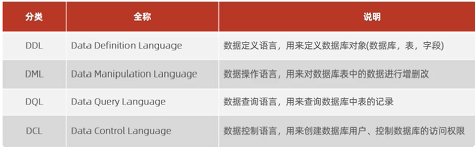

## DDL(数据定义语言)

### 数据库指令：

#### 查询所有数据库

```
SHOW DATABASES;
```

#### 查询当前数据库

```
SELECT DATABASE();
```

#### 创建

```
CREATE DATABASE (数据库名Database_Name);  
create database if not exists (数据库名);
create database ithema default charset utf8mb4; -- 定义了字符集
```

#### 删除

```
DROP DATABASE Database_Name;  
DROP DATABASE if exists Database_Name;  
```

#### 使用

```
use Database_Name;  
```


### 表指令

#### 创建表


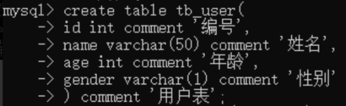

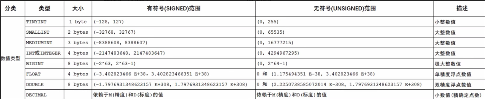


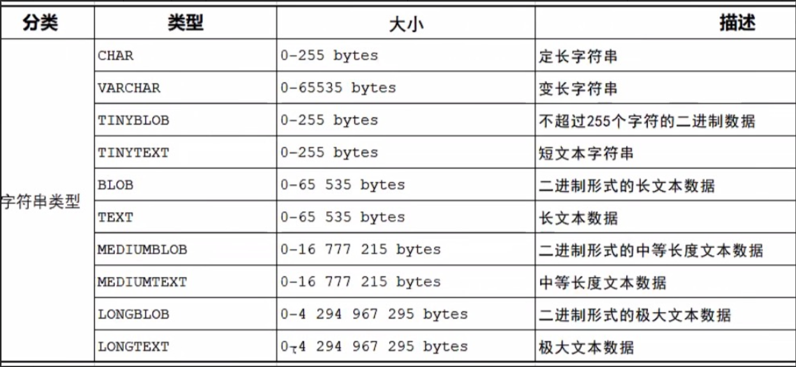

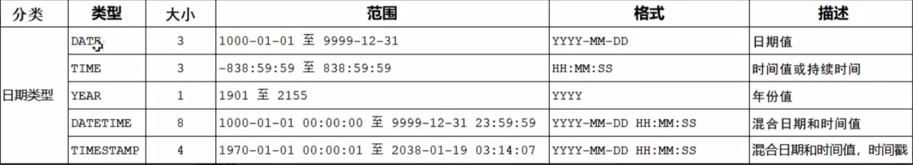


#### 删除表

```
drop table [if exist] table-name;
```

#### 删除指定表，并重新创建该表

```
truncate table table-name;
```

#### 修改表名

```
alter table table-name rename to new-table-name;
```

#### 查询表

```
show tables;
```

### 查询表结构

```
desc tb_user;
```

#### 查询指定表的建表结构

```
show create table tb_user;
```

### 表操作 

#### 添加字段

```
alter table table_name add 字段名 类型 [comment 'XX'];
```

#### 修改数据类型

```
alter table table_name modify 字段名 类型；
```

#### 修改字段名和字段类型

```
alter table table_name change 旧字段名 新字段名 类型 [comment 'XX']；
```

#### 删除字段

```
alter table table_name drop 字段名;
```

## DML(数据操作语言)

### INSERT 添加数据

```
column---字段

values---值
```

### 1. 给指定字段添加数据

```
INSERT INTO table_name (column1, column2, column3....)  
VALUES (value1, value2, value3.....);
```

### 2. 给全部字段添加数据

```
INSERT INTO table_name  
VALUES (value1, value2, value3....); 
```

### 3. 批量添加数据

```
INSERT INTO table_name (column1, column2, column3....),(column1, column2, column3....) 
VALUES (value1, value2, value3.....),(value1, value2, value3.....);
```

### 4.UPDATE 修改数据

```
UPDATE table_name SET [column_name1= value1,... column_nameN = valueN] [WHERE condition] 
```

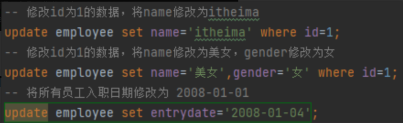


### 5.DELETE 删除数据

```sql
DELETE FROM table_name [WHERE condition];  
```

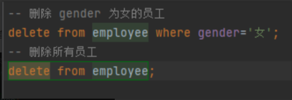

## DQL(数据查询语言)

### 编写顺序

```sql
SELECT字段列表FROM表名字段WHERE条件列表GROUP BY分组字段列表HAVING分组后的条件列表ORDER BY排序字段列表LIMIT分页参数
```

### 基本查询select from

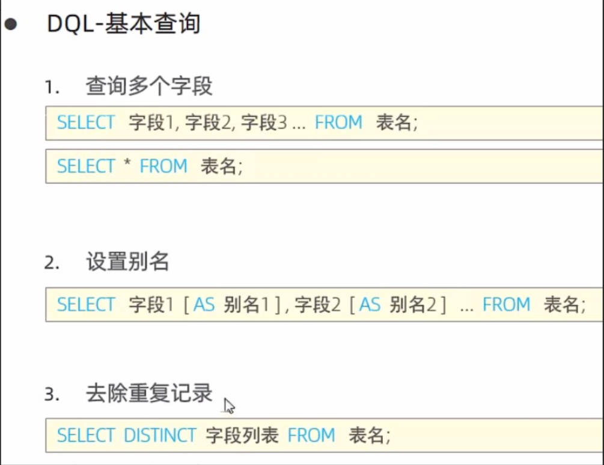


```sql
-- 基本查询

-- 1.  查询指定字段 name, workno, age 返回
select name,workno,age from emp;

-- 2.  查询所有字段返回
select * from emp;
select id, workno, name, gender, age, idcard, workaddress, entrydate from emp;

-- 3.  查询所有员工的工作地址,起别名
select workaddress from emp;
select workaddress as '工作地址' from emp;
select workaddress '工作地址' from emp;

-- 4.查询员工的上班地址（不要重复）
select workaddress from emp;
select distinct workaddress from emp;
```

### 条件查询 where

```
SELECT * FROM Name_of_Table WHERE [condition];  
```

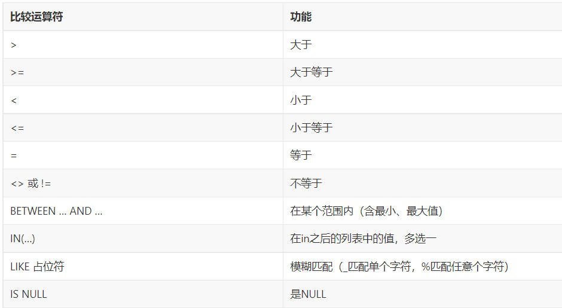


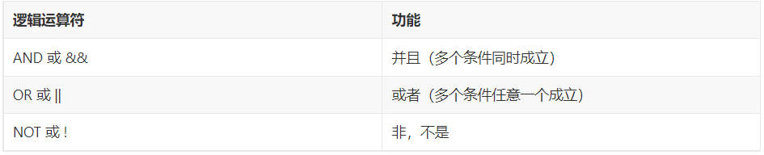

```
-- 条件查询
-- 1. 查询年龄等于88的员工
select * from emp where age = 88;

-- 2. 查询年龄小于20的员工信息
select * from emp where age < 20;

-- 3. 查询年龄小于等于20的员工信息
select * from emp where age <= 20;

-- 4. 查询没有身份证号的员工信息
select * from emp where idcard is NULL;

-- 5. 查询有身份证号的员工信息
select * from emp where idcard is not NULL;

-- 6. 查询年龄不等于88的员工信息
select * from emp where age != 88;

-- 7. 查询年龄在15岁（包含）到20岁（包含）直接的员工信息
select * from emp where age between 15 and 20;
select * from emp where age >= 15 and age <= 20;
select * from emp where age >= 15 && age <= 20;

-- 8. 查询性别为女 且 年龄小于25岁的员工信息
select * from emp where gender = '女' and age < 25;

-- 9. 查询年龄等于18 或 20 或 40 的员工信息
select * from emp where age = 18 or age = 20 or age = 40;
select * from emp where age in(18,20,40);

-- 10. 查询姓名为两个字的员工信息
select * from emp where name like '__';

-- 11. 查询身份证号最后一位是X的员工信息
select * from emp where idcard like '_________________X';
select * from emp where idcard like '%X';
```

### 聚合函数

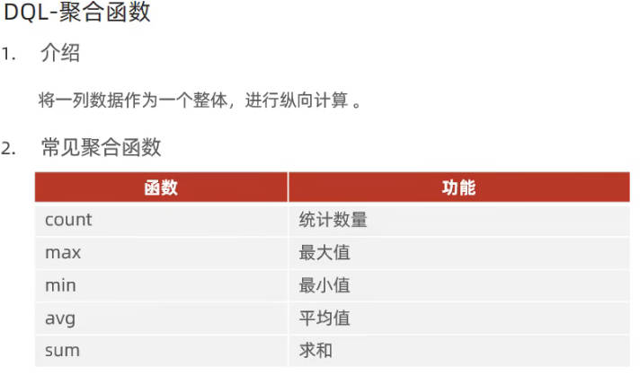

```
-- 1.统计该企业员工数量
select count(*)from emp;
select count(idcard) from emp;

-- 2.统计该企业员工的平均年龄
select avg(age) from emp;

-- 3.统计该企业员工的最大年龄
select max(age) from emp;

-- 4.统计该企业员工的最小年龄
select min(age) from emp;

-- 5.统计西安地区员工的年龄之和
select sum(age) from emp where workaddress = '西安';
```


### 分组查询

#### 语法

```
SELECT 字段列表 FROM 表名 [WHERE 条件] GROUP BY 分组字段名 [HAVING 分组后过滤条件]
```

#### where 与 having 区别

执行时机不同:where是分组之前进行过滤,不满足where条件,不参与分组;而having是分组之后对结果进行过滤.

判断条件不同:where不能对聚合函数进行判断,而having可以.

**注意**

**执行顺序: where > 聚合函数 > having**

**分组之后,查询的字段一般为聚合函数和分组函数,查询其他字段无任何意义**

### 排序查询

#### 语法

```
SELECT 字段列表 FROM 表名 ORDER BY 字段1 排序方式1,字段2 排序方式2;
```

#### 排序方式

ASC:升序(默认值)

DESC:降序

**注意:如果是多字段排序,当第一个字段值相同时,才会根据第二个字段进行排序** 

```mysql
-- 1.根据年龄对公司的员工进行升序排序
select * from emp order by age asc;
select * from emp order by age desc;

select * from emp order by age;

-- 2.根据入职时间,对员工进行降序排序
select * from emp order by  entrydate desc;

-- 3.根据年龄对公司的员工进行升序排序,年龄相同,再按照入职时间进行降序排序
select * from emp order by age asc , entrydate desc;

```


### 分页查询

#### 语法

```
SELECT 字段列表 FROM 表名 LIMIT 起始索引,查询记录数;
```

**注意**

**起始索引从0开始,起始索引 = (查询页码 - 1) * 每页显示记录数.**

**分页查询是数据库的方言,不同的数据库有不同的实现,MySQL中是LIMIT.**

**如果查询的是第一页数据,起始索引可以省略,直接简写为limit 10**

```mysql
-- 1. 查询第一页员工数据，每页展示10条记录
select * from emp limit 0,10;
-- 简写
select * from emp limit 0,10;

-- 2.查询第二页员工数据，每页展示10条数据
select * from emp limit 10,10;
```


### DQL 语句练习

```mysql
-- DQL 语句练习
-- 1.查询年龄为20，21，22，23岁的女性员工信息
select * from emp where gender = '女' and age in(20,21,22,23);

-- 2.查询性别为男，并且年龄在20-40岁（含）以内的姓名为三个字的员工
select * from emp where gender = '男' and age between 20 and 40 and name like '___';

-- 3.统计员工表中，年龄小于60岁的，男性员工和女性员工的人数。
select  gender,count(*) from emp where age < 60  group by  gender ;

-- 4.查询所有年龄小于等于35岁员工的姓名和年龄，并对查询结果按年龄升序排序，如果年龄相同按入职时间降序排序
select name,age from emp where age <= 35 order by age asc ,entrydate desc;

-- 5.查询性别为男，且年龄在20-40岁（含）以内的前5个员工信息，对查询的结果按年龄升序排序，年龄相同按入职时间降序排序
select * from emp  where gender ='男' and age between 20 and 40 order by  age asc ,entrydate desc limit 5;
```

### DQL执行循序

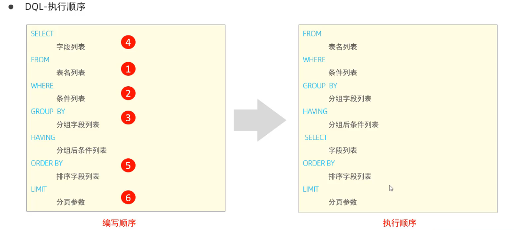


## DCL

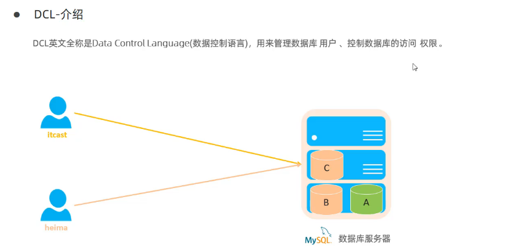


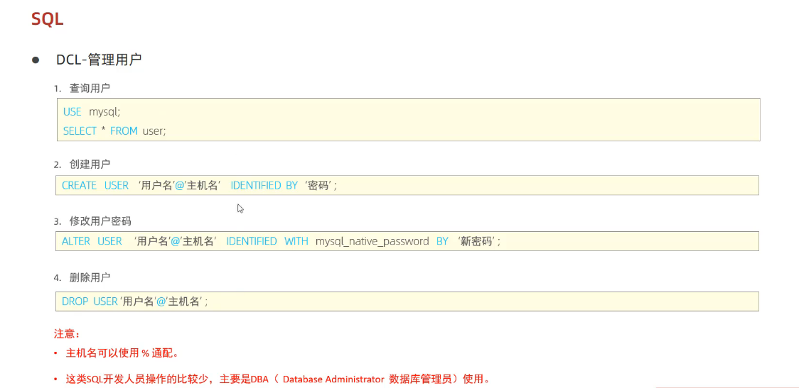

```mysql
-- 创建用户 itcast，只能够在当前主机localhost访问，密码123456
create user 'itcast'@'localhost' identified by '123456';

-- 创建用户 heima，可以在任意主机访问该数据库，密码123456
create user 'heima'@'%' identified by '123456';

-- 修改用户 heima 的访问密码为 1234
alter user 'heima'@'%' identified with mysql_native_password by '1234';
-- 删除itcast@localhost用户
drop user  'itcast'@'localhost';
```

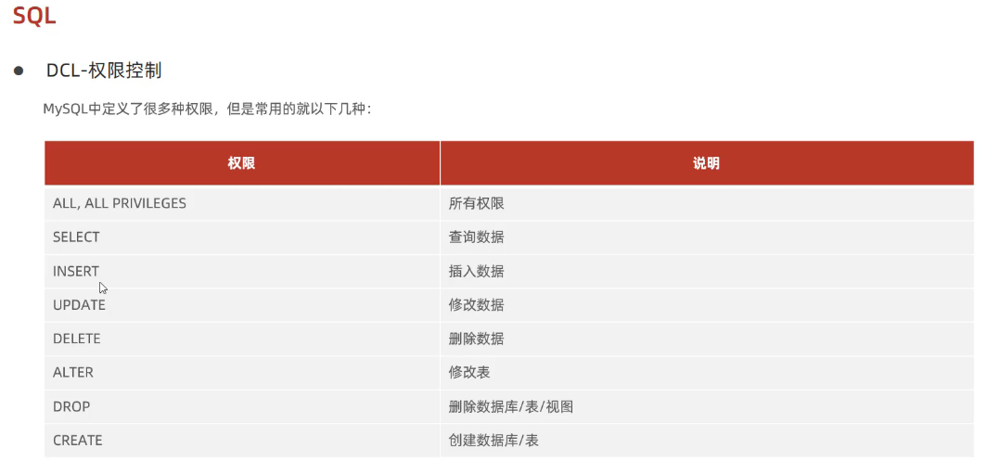

​	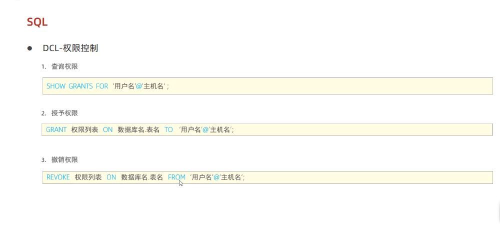


# MySQL

## 函数

### 字符串函数

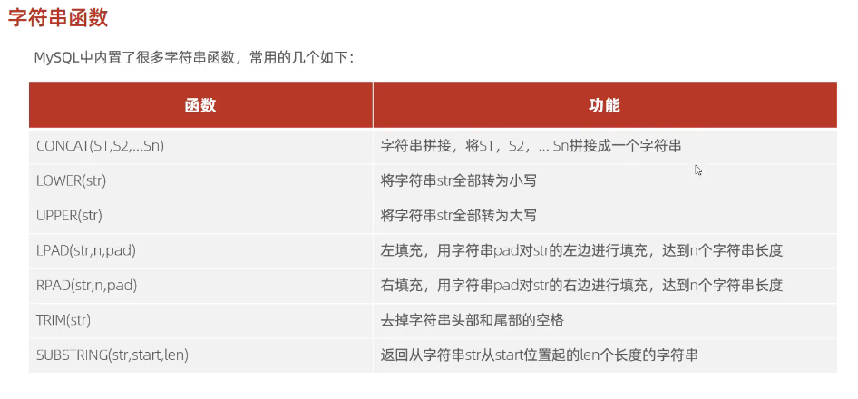	

```mysql
-- concat
select concat('hello',' MySQL');

-- lower
select  lower('Hello');

-- upper
select  upper('Hello');

-- lpad
select lpad('01',5,'-');
-- rpad
select rpad('01',5,'-');

-- trim
select trim('  Hello  MySQL  ')

-- substring
select substring('Hello MySQL',1,3)

-- 练习 根据需求完成一下sql编写
-- 由于业务需求变更，企业员工的工号，统一为五位数，目前不足5位数的全部在前面补0.比如：1号员工的工号应该为00001
update emp set workno =  lpad(workno,5,'0');
```


### 数值函数

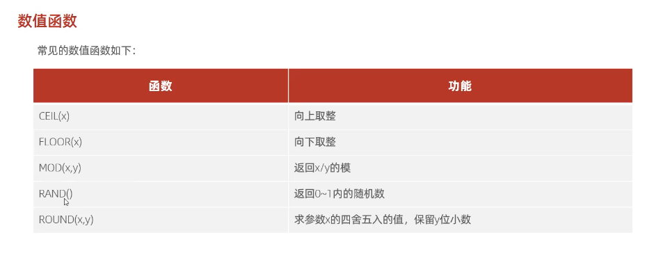

```mysql
-- 数值函数
-- ceil
select  ceil(1.1);
-- floor
select floor(1.9);
-- mod
select mod(3,4);
-- rand
select rand();
-- round
select round(2.34,1)


-- 练习
-- 通过数据库的函数，生成一个六位数的随机验证码
select lpad(ceil(rand() * 1000000),6,'0')  ;
```


### 日期函数

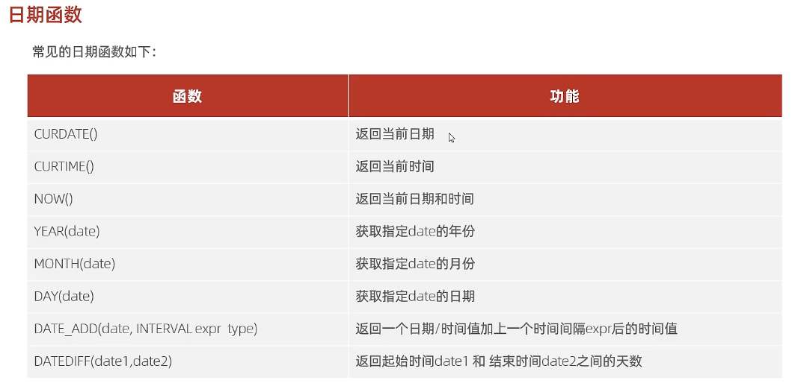

 

```mysql
-- 日期函数
-- curdate()
select curdate();

-- curtime()
select curtime();

-- now()
select now();

-- year,month,day;
select year(now());
select month(now());
select day(now());

-- data_add
select date_add(now(),interval 70 day);

-- datediff
select datediff('2021-12-01','2021-11-01');

-- 练习
-- 查询所有员工的入职天数，并根据入职天数倒序排序
select name,datediff(curdate(),entrydate) as 'entrydays'  from emp order by entrydays desc;
 
```


### 流程函数

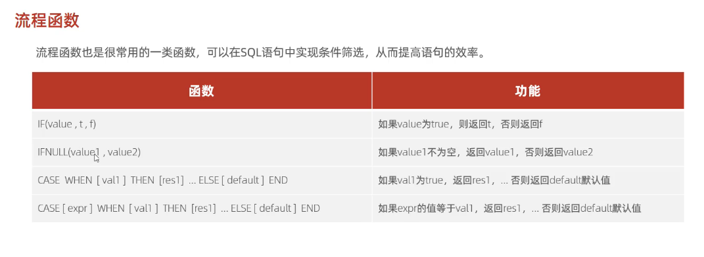

 

```mysql
-- 流程控制函数
-- if
 select ifnull('OK','default');   -- OK
 select ifnull('','default');     -- ''
select ifnull(null,'default');  -- default


-- case when then else end
-- 需求:查询 emp 表的员工姓名和工作地址(北京/上海 -> 一线城市, 其他 -> 二线城市)
select
    name,
    case workaddress when '北京' then '一线城市'
                     when '上海' then '一线城市'
                     else '二线城市'    end
                     as '工作地点'
from emp;

-- 案例: 统计班级各个学员的成绩,展示规则如下:
-- >=85 展示优秀
-- >=60 展示及格
-- 否则,展示不及格

create table score(
    id int comment 'ID',
    name varchar(20) comment '姓名',
    math int comment '数学',
    english int comment '英语',
    chinese int comment  '语文'
) comment  '学员成绩表';
insert into score (id,name,math,english,chinese) value
    (1,'Tom',67,88,95),
    (2,'Rose',23,66,90),
    (3,'Jack',56,98,76);

--
select
    id,
    name,
    case when math >= 85 then '优秀' when math >= 60 then '及格' else '不及格' end as'数学',
    case when english >= 85 then '优秀' when english >= 60 then '及格' else '不及格' end as'英语',
    case when chinese >= 85 then '优秀' when chinese >= 60 then '及格' else '不及格' end as'语文'
from score;


```


## 约束

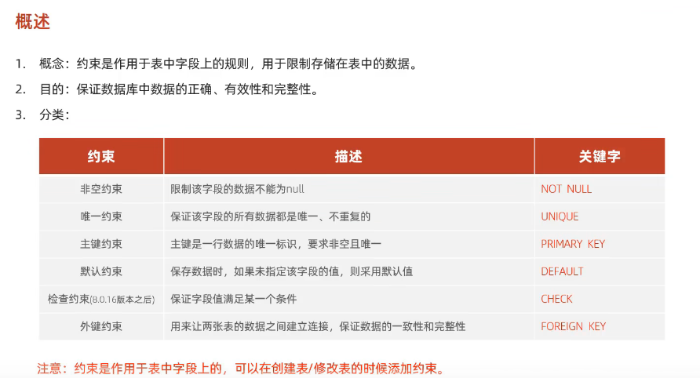

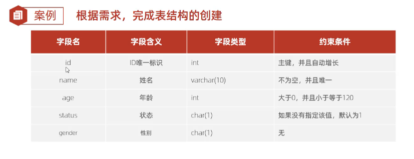

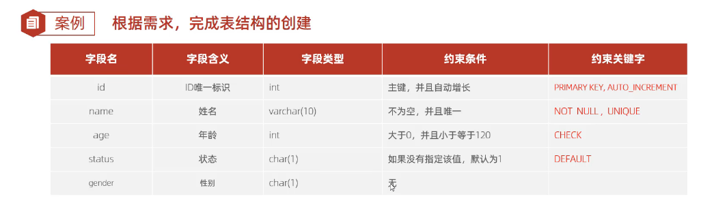

```mysql
create table user(
 id int primary key auto_increment comment 'ID 主键',
 name varchar(10) not null  unique  comment  '姓名',
 age int check (age > 0 && age <= 120) comment '年龄',
 status char(1) default '1' comment '状态',
 gender char(1) comment '性别'
)comment '用户表';

-- 插入数据
insert into user(name,age,status,gender) values('Tom1',19,1,'男'),('Tom2',25,0,'男');

insert into user(name,age,status,gender) values('Tom3',24,0,'男');

insert into user(name,age,status,gender) values(null,24,0,'男');    #姓名不能为null

insert into user(name,age,status,gender) values('Tom3',24,0,'男');  #姓名不能重复

insert into user(name,age,status,gender) values('Tom4',24,0,'男');

insert into user(name,age,status,gender) values('Tom5',-1,0,'男');  #年龄为0到120
insert into user(name,age,status,gender) values('Tom5',121,0,'男');

insert into user(name,age,gender) values('Tom5',120,'男');
```


## 外键约束

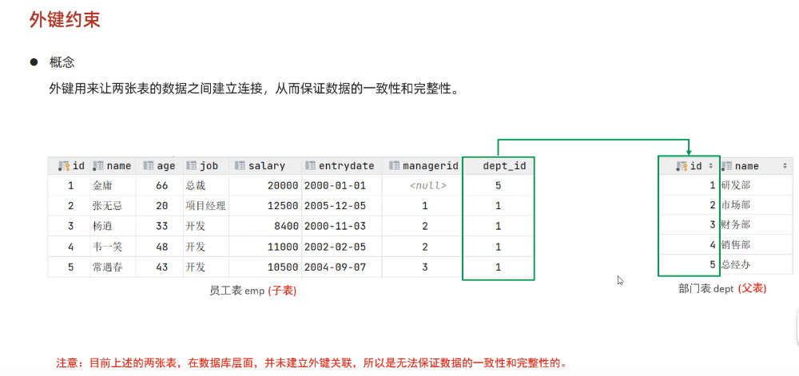

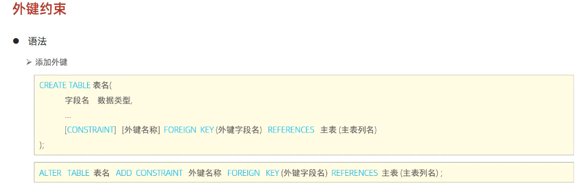


```mysql
-- 外键约束

-- 准备数据
create table dept(
    id int auto_increment comment 'ID' primary key ,
    name varchar(50) comment '部门名称' not null
)comment '部门表';

insert into dept(id, name) values (1,'研发部'),(2,'市场部'),(3,'财务部'),(4,'销售部'),(5,'总经办');

create table emp1(
    id int auto_increment primary key comment 'ID',
    name varchar(50) not null  comment '姓名',
    age int comment '年龄',
    job varchar(20) comment '职位',
    salary int comment '薪资',
    entrydate date comment '入职时间',
    managerid int comment '直属领导ID',
    dept_id int comment '部门ID'
)comment '员工表';

insert into emp1(id, name, age, job, salary, entrydate, managerid, dept_id) VALUES
    (1,'金庸',66,'总裁',20000,'2000-01-01',null,5),
    (2,'张无忌',20,'项目经理',12500,'2005-12-05',1,1),
     (3,'杨逍',33,'开发',8400,'2000-11-03',2,1),
    (4,'韦一笑',48,'开发',11000,'2002-02-05',2,1),
     (5,'常遇春',43,'开发',10500,'2000-11-03',3,1),
    (6,'小昭',19,'程序员鼓励师',6600,'2004-10-12',2,1);


-- 添加外键
alter table  emp1 add constraint  fk_emp_dept_id foreign key(dept_id) references dept(id);

-- 删除外键
alter table emp drop foreign key  fk_emp_dept_id;
```

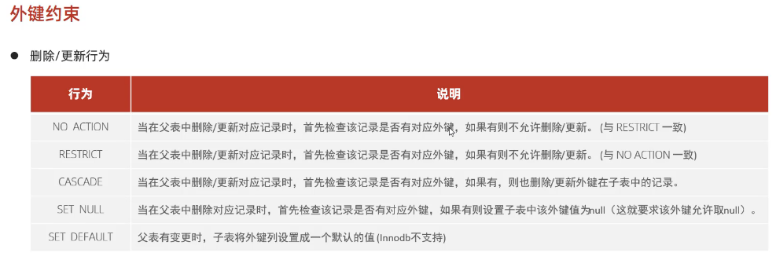


```mysql
-- 外键约束

-- 准备数据
create table dept(
    id int auto_increment comment 'ID' primary key ,
    name varchar(50) comment '部门名称' not null
)comment '部门表';

insert into dept(id, name) values (1,'研发部'),(2,'市场部'),(3,'财务部'),(4,'销售部'),(5,'总经办');

create table emp1(
    id int auto_increment primary key comment 'ID',
    name varchar(50) not null  comment '姓名',
    age int comment '年龄',
    job varchar(20) comment '职位',
    salary int comment '薪资',
    entrydate date comment '入职时间',
    managerid int comment '直属领导ID',
    dept_id int comment '部门ID'
)comment '员工表';

insert into emp1(id, name, age, job, salary, entrydate, managerid, dept_id) VALUES
    (1,'金庸',66,'总裁',20000,'2000-01-01',null,5),
    (2,'张无忌',20,'项目经理',12500,'2005-12-05',1,1),
     (3,'杨逍',33,'开发',8400,'2000-11-03',2,1),
    (4,'韦一笑',48,'开发',11000,'2002-02-05',2,1),
     (5,'常遇春',43,'开发',10500,'2000-11-03',3,1),
    (6,'小昭',19,'程序员鼓励师',6600,'2004-10-12',2,1);


-- 添加外键
alter table  emp1 add constraint  fk_emp_dept_id foreign key(dept_id) references dept(id);

-- 删除外键
alter table emp1 drop foreign key  fk_emp_dept_id;


-- 外键的删除和更新行为
alter table emp1 add constraint  fk_emp_dept_id foreign key  (dept_id) references dept(id) on update cascade on delete cascade ;

alter table emp1 add constraint  fk_emp_dept_id foreign key  (dept_id) references dept(id) on update set null on delete set null ;
```


## 多表查询

### 多表关系

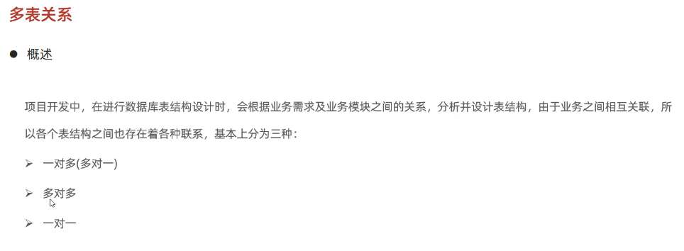

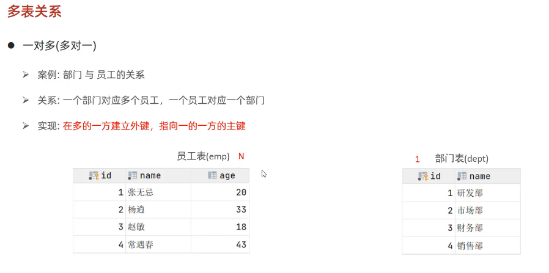

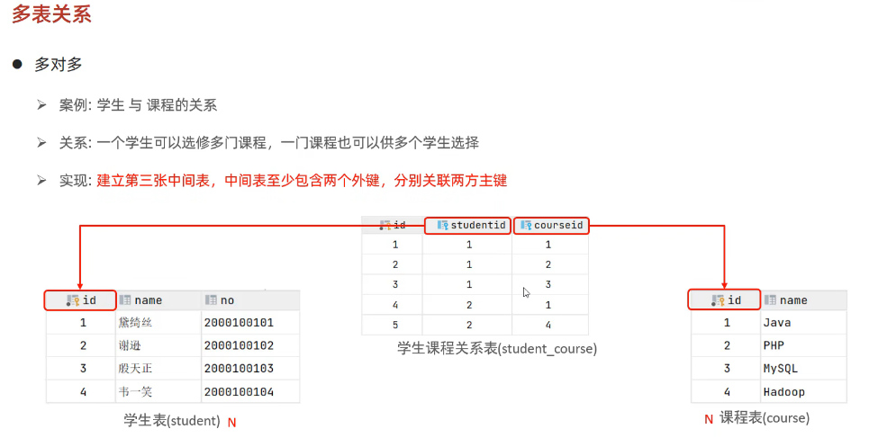


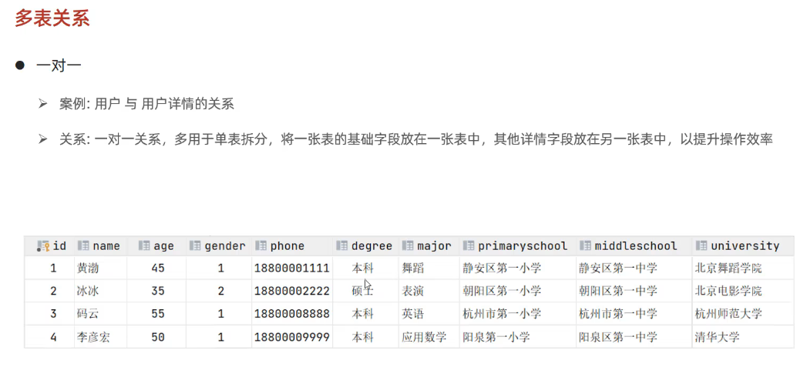

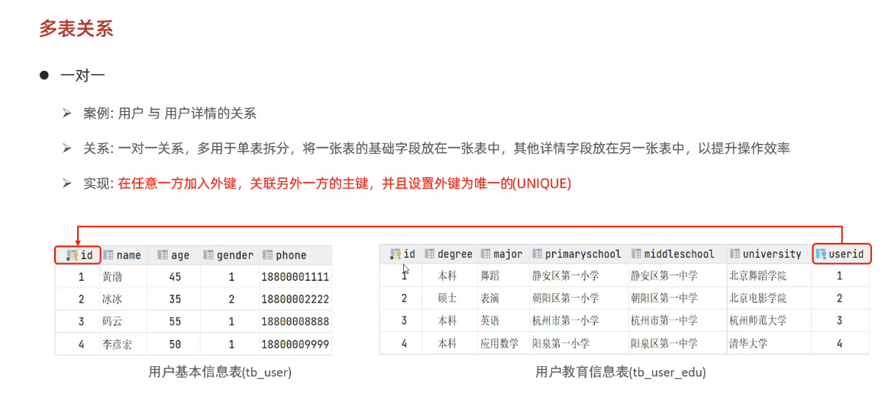

### 多表查询概述

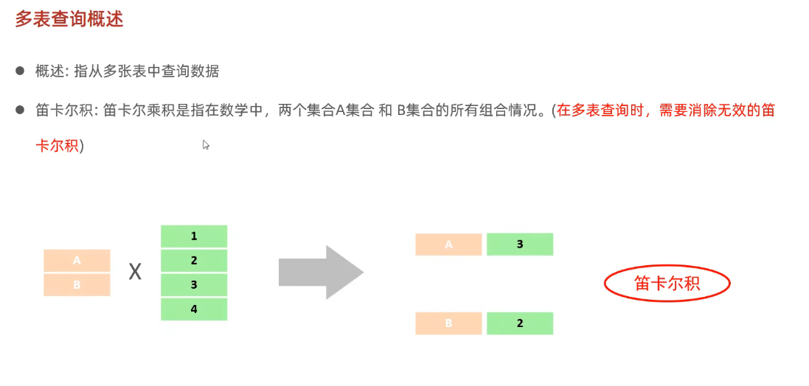

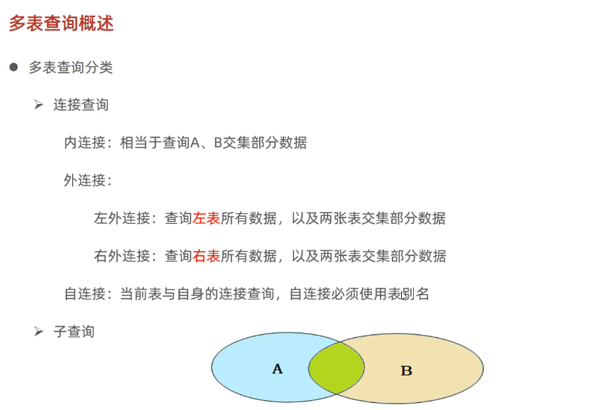


### 内连接

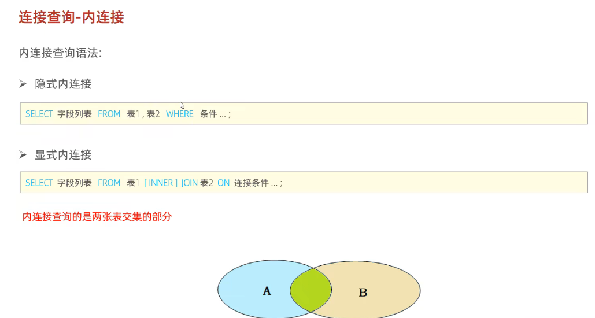


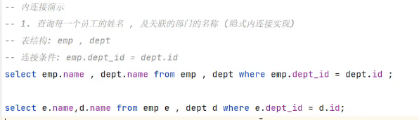

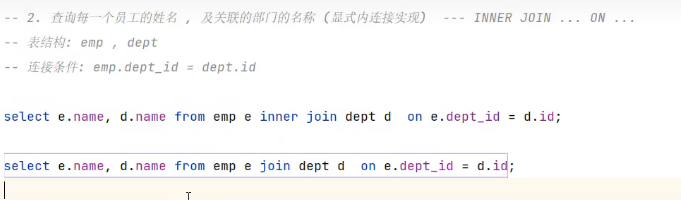

### 外连接


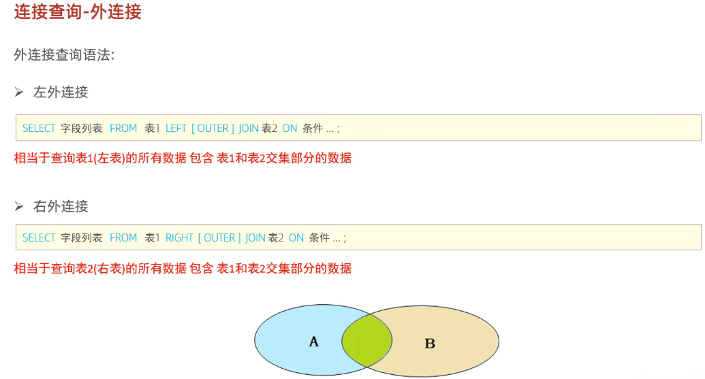


### 自连接


### 联合查询


去掉 all 后 可以实现去重


### 子查询


#### 标量子查询


 


#### 列子查询


 


 

#### 行子查询


#### 表子查询


### 总结


## 事务

### 事务简介


### 事务操作


@@autocommit   1 自动提交  0 手动提交

set @@autocommit = 0 设置为手动提交


程序报错


### 事务四大特性


### 并发事务问题


### 事务隔离级别

